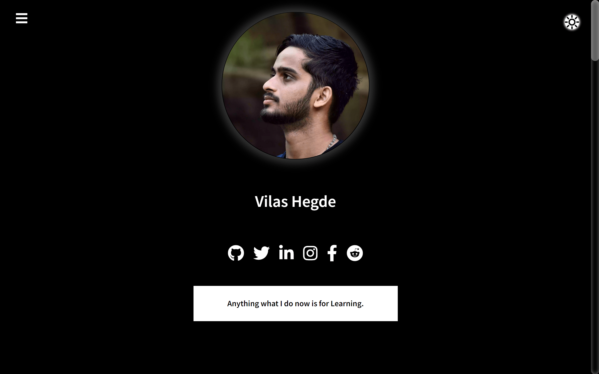
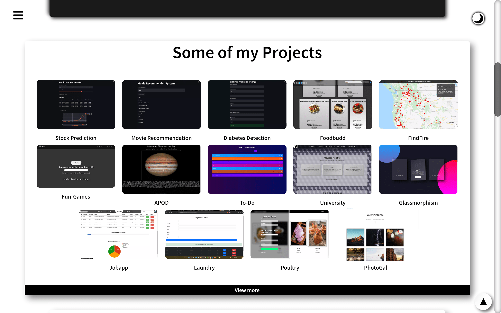
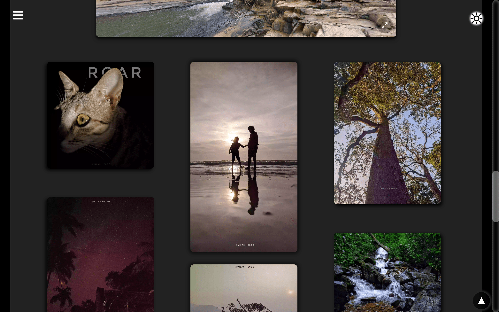

# Welcome to my Portfolio!
>This was my first web-based project.

## Things that I've used:
- HTML
- CSS
- Javascript

This site has been hosted in [Github Pages](https://vilasrhegde.github.io/).

**My Home page**

Given night/light mode option also.
  

**Projects list**

**Photograph samples**

> Still it is a static website that I oftenly updating the contents and skills sections as I when get time to do.

At last I thank you for coming down till here. : )
